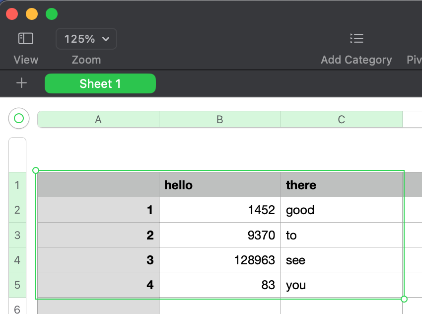
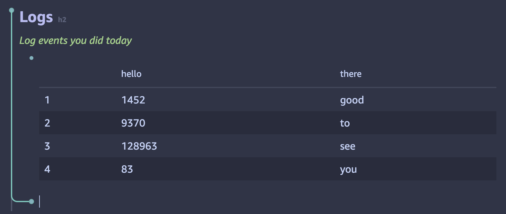
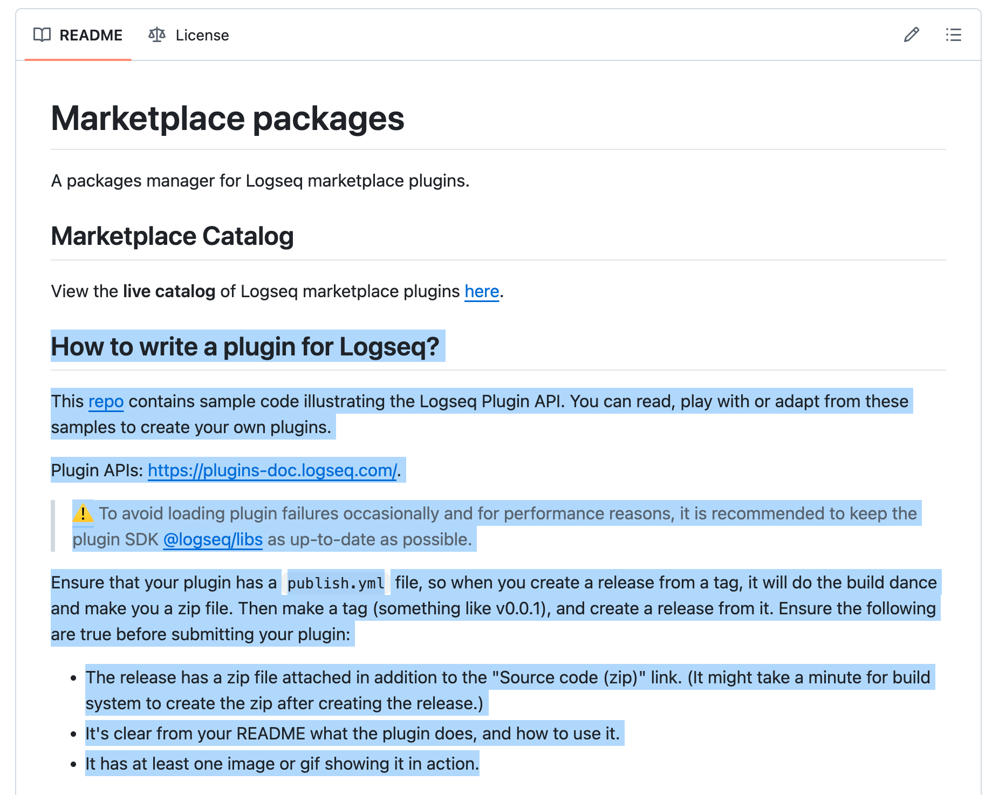
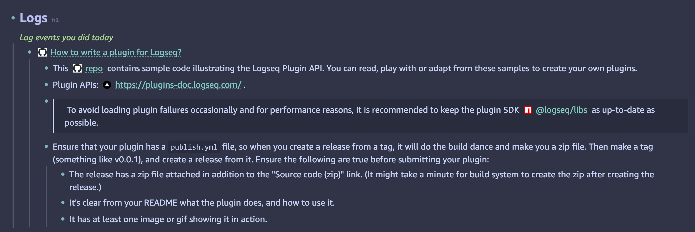
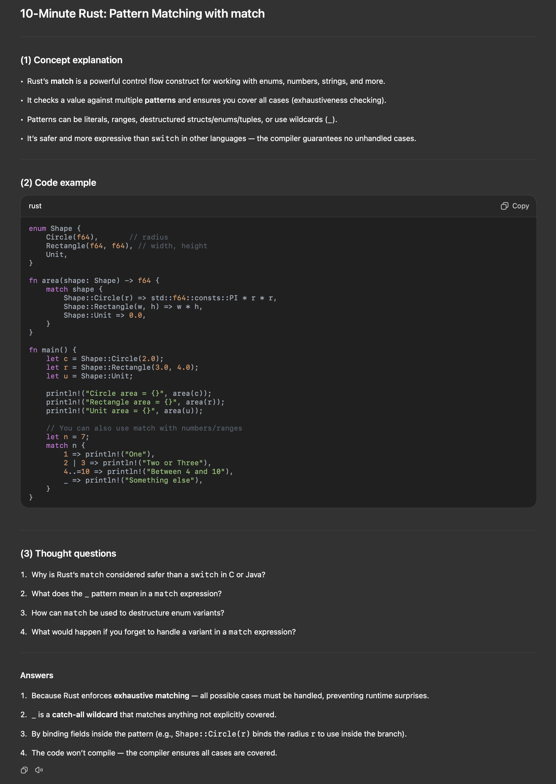
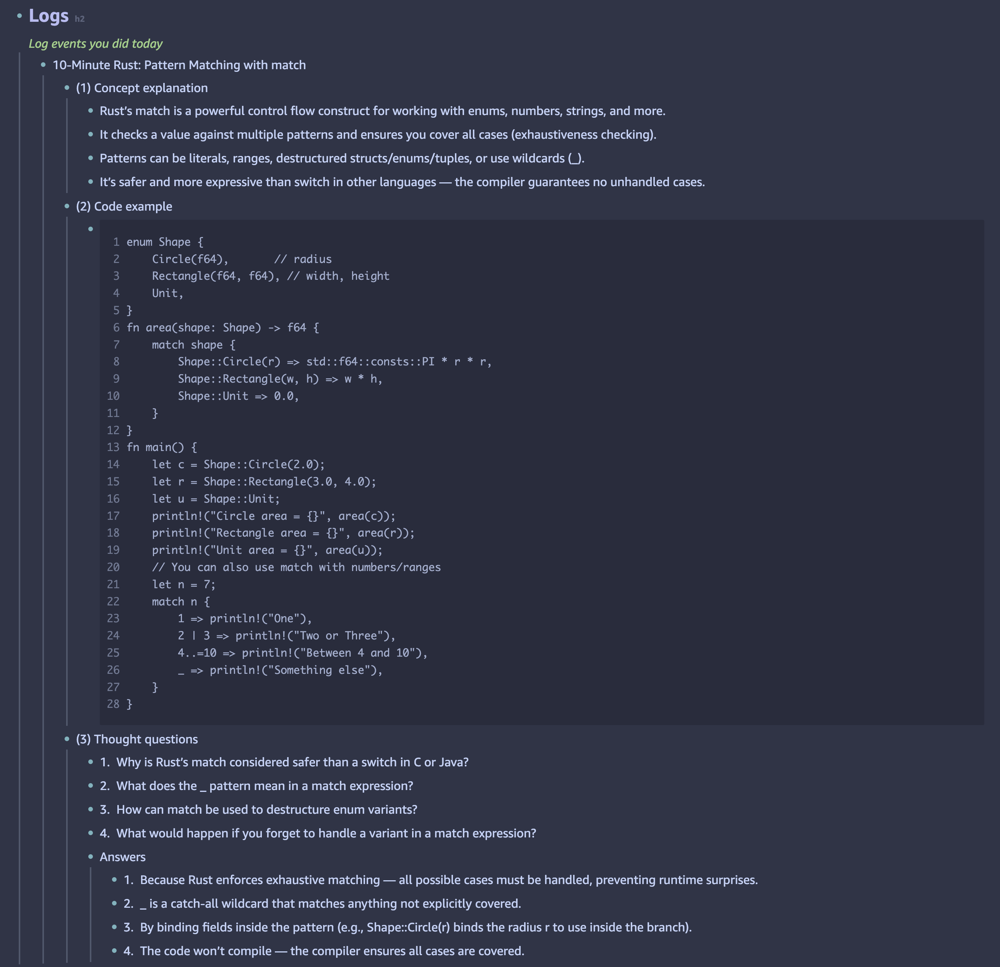

# LogSeq Paste It Plugin

> **A fork of [logseq-plugin-paste-more](https://github.com/usoonees/logseq-plugin-paste-more)** with enhanced functionality and content filtering options.

Enhanced paste functionality for LogSeq that retains formatting when pasting from external sources with content cleaning capabilities.

The reason for enhancing this is because when I copy and paste the responses from AI tools like Claude and ChatGPT, the markdown text is not copied well. Even though the original plugin works well, but I wanted to clean up something more like headers, bold formatting, and other elements that can clutter pasted content.

## Features

Core Functionality:

- Rich text formatting preservation from external sources
- Intelligent content detection (external vs. LogSeq internal)
- Code block and table structure preservation
- Header hierarchy management with indentation support

Content Filtering Options:

- Header Removal: Remove markdown headers (#) when pasting
- Bold Removal: Remove strong tags (\*\*) when pasting
- Horizontal Rule Removal: Remove horizontal rules (---) when pasting
- Emoji Removal: Remove emojis and unicode symbols when pasting

## Installation

Install from LogSeq Marketplace.

## Configuration

Access plugin settings through LogSeq Settings → Plugin Settings → Paste It:

| Setting                 | Description                                    | Default |
| ----------------------- | ---------------------------------------------- | ------- |
| Indent Headers          | Indent headers according to their level        | `true`  |
| New Line Block          | Create separate blocks for each line           | `true`  |
| Remove Headers          | Remove header tags (#) when pasting            | `false` |
| Remove Bolds            | Remove strong tags (\*\*) when pasting         | `false` |
| Remove Horizontal Rules | Remove horizontal rules (---) when pasting     | `false` |
| Remove Emojis           | Remove emojis and unicode symbols when pasting | `false` |

## Usage

The plugin automatically enhances paste behavior from external sources. No additional actions are required. If you encounter any problems with pasting, please disable the plugin temporarily and submit an issue.

## Demo

### Paste from Numbers

### Paste from GitHub README

### Paste from ChatGPT

## Supported Sources

- Microsoft Excel - Tables with formatting preservation
- Google Docs - Rich text with automatic wrapper removal
- GitHub - Code blocks and markdown content
- Web Pages - General HTML content conversion
- Feishu/Lark - Documents and tables

## Acknowledgements

- Original Plugin: [logseq-plugin-paste-more](https://github.com/usoonees/logseq-plugin-paste-more) by usoonlinux
- HTML to Markdown: [turndown](https://github.com/mixmark-io/turndown) library
- Block Indentation: Logic inspired by [logseq-plugin-split-block](https://github.com/hyrijk/logseq-plugin-split-block)

## License

Same as original project - check source repository for details.

---

Note: This plugin is always enabled once installed. If you encounter paste issues, disable the plugin temporarily and report the issue.
